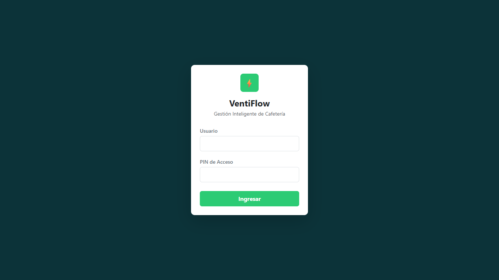
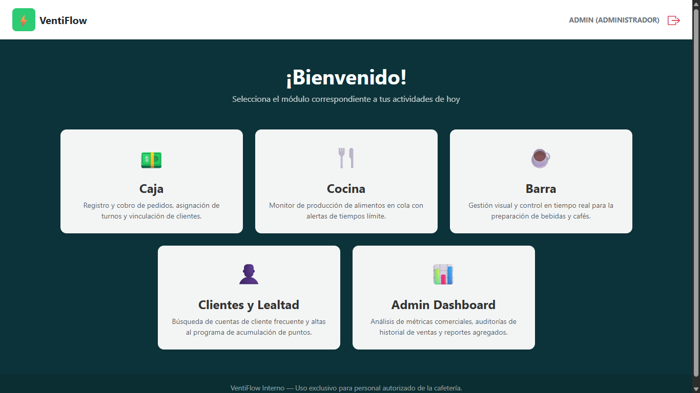
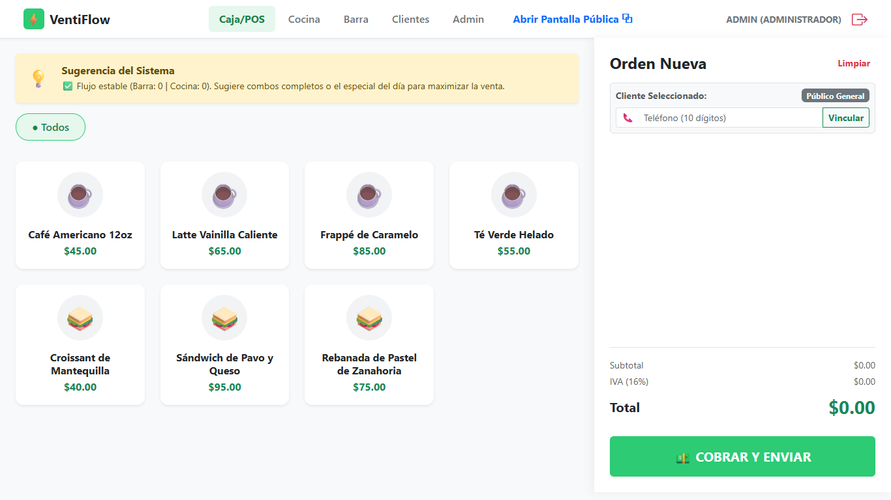
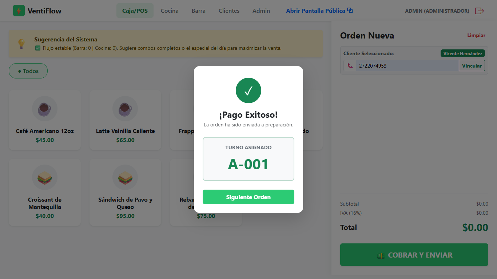
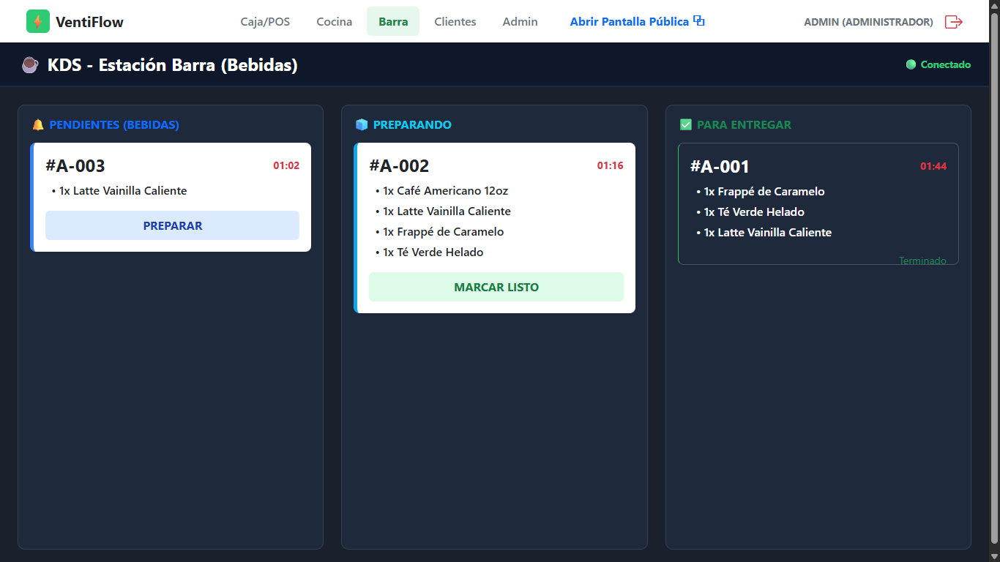
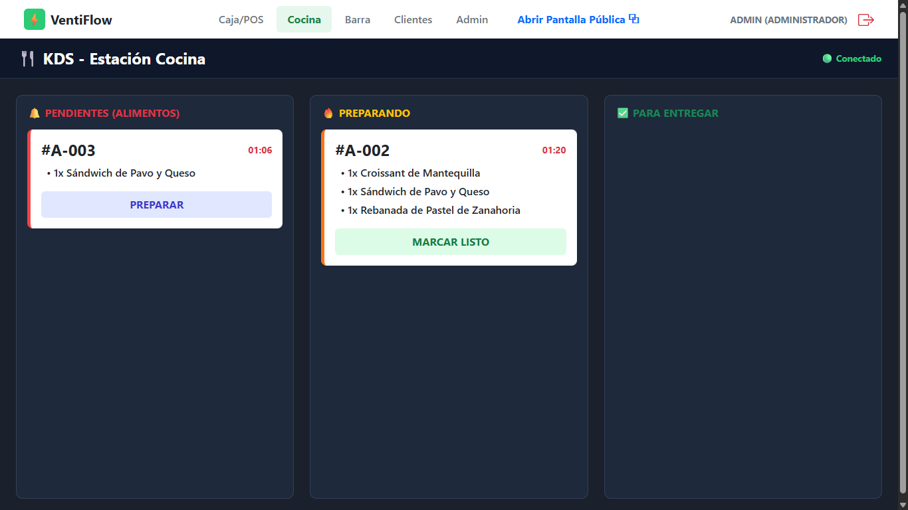
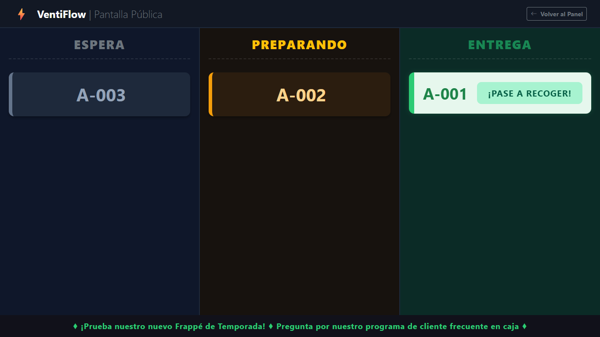
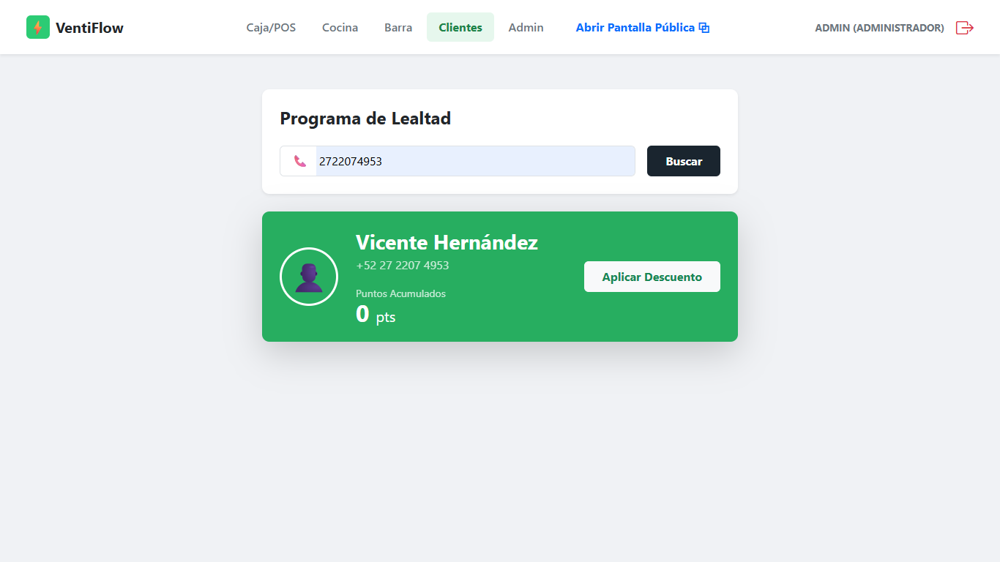
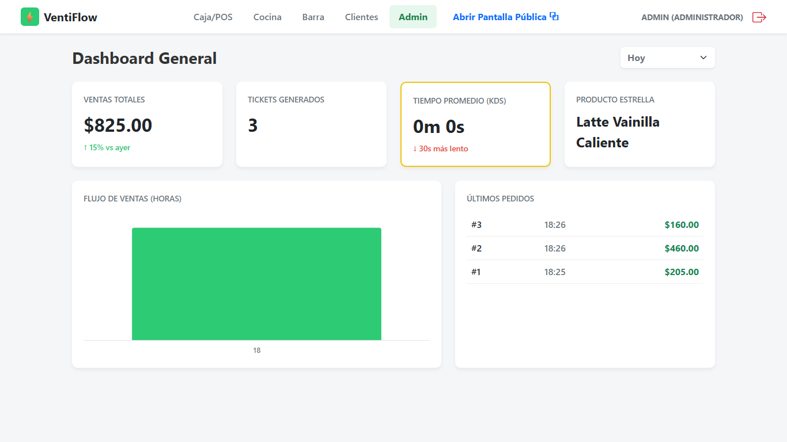

# ☕ VentiFlow

> Sistema de gestión de pedidos en tiempo real para cafeterías, con pantallas KDS, visor público y programa de lealtad.


---

## 📋 Tabla de Contenidos

- [El problema](#-el-problema)
- [La solución](#-la-solución)
- [Vista previa](#-vista-previa)
- [Tecnologías](#-tecnologías)
- [Arquitectura del sistema](#-arquitectura-del-sistema)
- [Requisitos previos](#-requisitos-previos)
- [Instalación y configuración](#-instalación-y-configuración)
- [API Reference](#-api-reference)
- [WebSockets / Tiempo real](#-websockets--tiempo-real)
- [Estructura del proyecto](#-estructura-del-proyecto)
- [Estructura de la base de datos](#-estructura-de-la-base-de-datos)
- [Estado actual del proyecto](#-estado-actual-del-proyecto)
- [Qué haría con un día más](#-qué-haría-con-un-día-más)
- [Autor](#-autor)

---

## 🔍 El problema

VentiFlow nació de una situación real, no de un ejercicio de práctica: una cafetería donde observé de primera mano cómo los pedidos se retrasaban y el flujo de tráfico —tanto de clientes como de personal— se volvía caótico en horas pico. No había una forma clara de saber qué pedido iba en cocina, cuál en barra, ni cuál ya estaba listo. El personal preguntaba, los clientes esperaban sin información, y la caja no tenía visibilidad de nada una vez que el pedido salía de sus manos.

## 💡 La solución

VentiFlow es un sistema de gestión de pedidos tipo POS que separa el flujo de trabajo por área de preparación (**Cocina** y **Barra**) y le da a cada estación su propia pantalla en tiempo real (KDS). Cada pedido pasa por 3 etapas —**Pendiente → Preparando → Listo**— y esos cambios se propagan al instante vía WebSocket a:

- La pantalla del área correspondiente (para que el personal solo vea lo que le toca a él).
- Una **pantalla pública** para que el cliente siga su propio pedido sin tener que preguntar.
- El **dashboard del administrador**, con métricas de venta en vivo.

Además, la caja puede vincular cada venta a un **programa de lealtad** por número de teléfono, acumulando puntos sin fricción para el cliente.

---

## 🖼️ Vista previa

**1. Login del sistema**
Acceso simple por usuario y PIN — pensado para terminales compartidas de una cafetería, no para logins personales de escritorio.



**2. Selector de módulos**
Cada rol entra a su propio panel: Caja, Cocina, Barra, Clientes y Admin viven como módulos independientes dentro de la misma app.



**3. Caja / POS**
El cajero arma la orden, la vincula a un cliente por teléfono y ve el subtotal, IVA y total calculados en vivo.



**4. Confirmación y turno asignado**
Al cobrar, el sistema genera un turno (`A-001`, `A-002`...) y envía automáticamente cada producto a su estación correspondiente.



**5 y 6. KDS por estación**
Barra y Cocina reciben *solo* los productos que les corresponden, con temporizador visible por pedido para detectar demoras.




**7. Pantalla pública**
El cliente ve su turno moverse de "Espera" a "Preparando" a "Entrega" sin necesidad de preguntarle a nadie — y aprovecha el espacio para mostrar promociones.



**8. Programa de lealtad**
Búsqueda de cliente por teléfono, alta rápida si no existe, y acumulación de puntos visible en la misma pantalla de caja.



**9. Dashboard de administrador**
Ventas totales, tickets generados, tiempo promedio de KDS, producto estrella y flujo de ventas por hora — todo calculado sobre datos reales del historial de pedidos.



---

## 🛠️ Tecnologías

| Capa           | Tecnología                   |
| -------------- | ----------------------------- |
| Backend        | Java 17 + Spring Boot 3.5     |
| Persistencia   | Spring Data JPA + PostgreSQL  |
| Tiempo real    | Spring WebSocket + STOMP      |
| Migraciones DB | Flyway                        |
| Frontend       | HTML, CSS, JavaScript         |
| Validación     | Spring Validation             |
| Utilities      | Lombok, Spring DevTools       |
| Build          | Maven                         |

---

## 🏗️ Arquitectura del sistema

```
┌─────────────┐     REST API      ┌──────────────────┐
│    Caja     │ ────────────────► │                  │
│  (Cashier)  │                   │   Spring Boot    │
└─────────────┘                   │     Backend      │
                                   │                  │
┌─────────────┐    WebSocket       │  /ws-ventiflow   │
│ KDS Cocina  │ ◄──────────────── │                  │
│  KDS Barra  │                   │   PostgreSQL     │
└─────────────┘                   │                  │
                                   └──────────────────┘
┌─────────────┐    WebSocket
│  TV Pública │ ◄────────────────
│    (CDS)    │
└─────────────┘
```

Un solo pedido dispara hasta tres destinos distintos (Cocina, Barra, Pantalla pública) según qué productos contenga, sin que la caja tenga que saber a quién le toca cada cosa — esa lógica vive en el backend.

---

## ✅ Requisitos previos

- **Java 17** o superior
- **Maven 3.8+**
- **PostgreSQL 14+** (base de datos corriendo y accesible)

---

## ⚙️ Instalación y configuración

### 1. Clonar el repositorio

```bash
git clone https://github.com/vicenhr/ventiflow.git
cd ventiflow
```

### 2. Configurar la base de datos

```sql
CREATE DATABASE ventiflow;
```

### 3. Configurar `application.properties`

Edita `src/main/resources/application.properties` con tus credenciales:

```properties
spring.datasource.url=jdbc:postgresql://localhost:5432/ventiflow
spring.datasource.username=TU_USUARIO
spring.datasource.password=TU_CONTRASEÑA

spring.jpa.hibernate.ddl-auto=validate
spring.flyway.enabled=true
```

> Las migraciones de Flyway se ejecutan automáticamente al iniciar la aplicación.

### 4. Compilar y ejecutar

```bash
mvn spring-boot:run
```

El servidor queda disponible en `http://localhost:8080`.

---

## 📡 API Reference

Todas las rutas bajo `/api/v1/` (excepto las indicadas) requieren autenticación mediante token de sesión.

### 🔐 Autenticación

#### `POST /api/v1/auth/login`

Inicia sesión y obtiene un token de acceso.

**Requiere autenticación:** No

```json
// Body
{
  "usuario": "string",
  "clave": "string"
}
```

```json
// Respuesta 200 OK
{
  "token": "...",
  "rol": "ADMIN",
  "alias": "Vicente"
}
```

### 👤 Clientes

#### `GET /api/v1/clientes/{telefono}`

Busca un cliente por su número de teléfono.

```json
// Respuesta 200 OK
{
  "idCliente": 1,
  "nombreAlias": "Ana",
  "telefono": "5512345678",
  "puntosAcumulados": 150
}
```

#### `POST /api/v1/clientes`

Registra un nuevo cliente en el programa de lealtad.

```json
// Body
{
  "telefono": "5512345678",
  "nombreAlias": "Ana"
}
```

**Respuesta `201 Created`:** Objeto del cliente con `puntosAcumulados: 0`.

### 📦 Pedidos

#### `POST /api/v1/pedidos`

Crea un nuevo pedido desde caja.

**Requiere rol:** `CAJA`

```json
// Body
{
  "idUsuario": 2,
  "idCliente": 1,
  "detalles": [
    { "idProducto": 5, "cantidad": 1 },
    { "idProducto": 3, "cantidad": 2 }
  ]
}
```

**Respuesta `201 Created`:** `PedidoDTO` completo con `turnoAsignado` generado (ej. `"A-001"`).

#### `GET /api/v1/pedidos/activos?area={area}`

Obtiene los pedidos activos filtrados por área de preparación.

| Query Param | Valores posibles |
| ----------- | ----------------- |
| `area`      | `Cocina`, `Barra` |

**Estados incluidos:** `PENDIENTE`, `PREPARANDO`, `LISTO`

#### `PATCH /api/v1/pedidos/{idPedido}/estado`

Actualiza el estado general de un pedido.

**Requiere rol:** Verificación por roles

```json
// Body
{
  "estadoGeneral": "PREPARANDO"
}
```

**Estados válidos:** `PENDIENTE` → `PREPARANDO` → `LISTO` → `ENTREGADO`

#### `GET /api/v1/pedidos/pantalla-publica`

Devuelve todos los pedidos activos del local para carga inicial de la pantalla pública.

**Requiere autenticación:** No

#### `GET /api/v1/pedidos/historial?fechaInicio={fecha}&fechaFin={fecha}`

Obtiene el historial de pedidos en un rango de fechas para el dashboard.

**Requiere rol:** `ADMIN`

| Query Param   | Formato      |
| ------------- | ------------ |
| `fechaInicio` | `YYYY-MM-DD` |
| `fechaFin`    | `YYYY-MM-DD` |

---

## 🔌 WebSockets / Tiempo real

**Endpoint de conexión:** `http://localhost:8080/ws-ventiflow`
**Protocolo:** STOMP sobre WebSocket

### Tópicos disponibles

| Tópico | Quién lo escucha | Payload |
|---|---|---|
| `/topic/kds/cocina` | Pantalla de Cocina | `PedidoDTO` completo |
| `/topic/kds/barra` | Pantalla de Barra/Baristas | `PedidoDTO` completo |
| `/topic/cds/publico` | TV pública del local | `{ "turnoAsignado": "A-001", "estadoGeneral": "LISTO" }` |

### Ejemplo de suscripción (JavaScript)

```javascript
const socket = new SockJS('http://localhost:8080/ws-ventiflow');
const stompClient = Stomp.over(socket);

stompClient.connect({}, () => {
  stompClient.subscribe('/topic/kds/cocina', (message) => {
    const pedido = JSON.parse(message.body);
    console.log('Nuevo pedido en cocina:', pedido);
  });
});
```

---

## 📁 Estructura del proyecto

```
ventiflow/
├── backend/
│   ├── src/
│   │   ├── main/
│   │   │   ├── java/blav/ventiflow/
│   │   │   │   ├── auth/          # Autenticación y tokens
│   │   │   │   ├── cliente/       # Gestión de clientes y lealtad
│   │   │   │   ├── pedido/        # Lógica de pedidos y KDS
│   │   │   │   ├── websocket/     # Configuración STOMP y eventos
│   │   │   │   └── config/        # Configuración general
│   │   │   └── resources/
│   │   │       ├── db/migration/  # Scripts Flyway (V1__, V2__...)
│   │   │       └── static/        # Frontend (HTML, CSS, JS)
│   │   └── test/
│   └── pom.xml
└── frontend/
```

---

## 🗄️ Estructura de la base de datos

El esquema es gestionado automáticamente por **Flyway** al arrancar la aplicación. El formato estándar de un pedido en el sistema (`PedidoDTO`) es:

```json
{
  "idPedido": 13,
  "turnoAsignado": "A-001",
  "estadoGeneral": "PENDIENTE",
  "fechaHoraCreacion": "2026-06-07T19:30:38.178527",
  "detalles": [
    {
      "idProducto": 5,
      "nombreProducto": "Croissant de Mantequilla",
      "cantidad": 1
    }
  ]
}
```

---

## 🚧 Estado actual del proyecto

Quiero ser directo sobre esto: VentiFlow **funciona de punta a punta** (caja → KDS → pantalla pública → dashboard, como se ve en las capturas de arriba), pero todavía no lo considero terminado. Así está repartido:

**Funciona y está probado manualmente:**
- Flujo completo de un pedido, desde que se cobra en caja hasta que cambia de estado en Cocina/Barra y se refleja en la pantalla pública.
- Cálculo de subtotal, IVA y total en caja.
- Alta y búsqueda de clientes por teléfono, con acumulación de puntos.
- Dashboard con métricas agregadas desde el historial real de pedidos.

**Existe pero no está conectado end-to-end:**
- El módulo de autenticación (`/api/v1/auth/login`) devuelve un rol y un token, pero la aplicación **no está aplicando ese rol para restringir rutas todavía** — por ahora cualquier usuario autenticado puede llegar a cualquier módulo. La verificación por rol en `PATCH /pedidos/{id}/estado` está definida a nivel de diseño, no forzada en todos los endpoints.
- La aplicación de descuentos por puntos de lealtad (botón "Aplicar Descuento") está en la interfaz pero la lógica de redención todavía no resta puntos ni recalcula el total.

**No implementado todavía:**
- Persistencia de sesión más allá de la pestaña actual (no hay refresh token).
- Manejo de errores de red en las pantallas KDS si se pierde la conexión WebSocket (actualmente requiere recargar).
- Pruebas automatizadas — todo lo de arriba lo validé manualmente, no con un test suite.

Prefiero documentar esto así en lugar de dejar que se descubra a medias: el sistema resuelve el problema original (visibilidad y velocidad de pedidos), pero el manejo de usuarios y roles es la pieza más grande que falta para llamarlo "listo para producción".

---

## 🔭 Qué haría con un día más

1. **Terminar la capa de autorización**: aplicar el rol devuelto por `/auth/login` como un guard real en el backend (Spring Security con roles), en vez de solo mostrarlo en la UI.
2. **Cerrar el ciclo de lealtad**: conectar "Aplicar Descuento" para que efectivamente reste puntos y recalcule el total antes de cobrar.
3. **Reconexión automática de WebSocket** en las pantallas KDS y la pantalla pública, para que un corte de red momentáneo no obligue a recargar la pantalla en medio de un turno de trabajo.
4. Empezar a cubrir la lógica de asignación de turnos y cálculo de totales con pruebas unitarias, ya que es la parte más sensible a romperse silenciosamente si alguien la modifica después.

---

## 👤 Autor

**Vicente Hernández Ramos** — [@vicenhr](https://github.com/vicenhr)